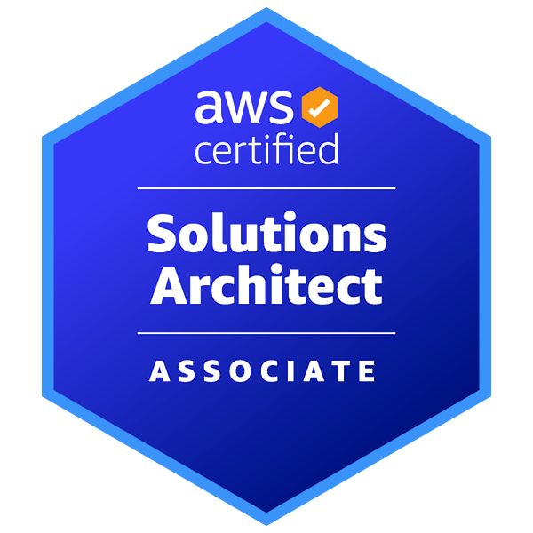

<!-- ══════════════════════════════════════════════════════════════════════════
     Muhammad Usman Shams — Official GitHub Profile README
     Software Engineer · AI/ML Researcher · UI/UX Systems Architect
     ══════════════════════════════════════════════════════════════════════════ -->

  <!-- ── HEADER BANNER ── -->
  

  <!-- ── SUBTITLE METRICS ── -->
  

    <b>⚡ 13+ Research Projects &nbsp;&nbsp;·&nbsp;&nbsp; 📄 6+ Peer-Reviewed Publications &nbsp;&nbsp;·&nbsp;&nbsp; 🏆 AWS · Azure · Google Certified &nbsp;&nbsp;·&nbsp;&nbsp; 🎓 CGPA 3.68/4.00 (Rank 4th)</b>
  

  <!-- ── DYNAMIC TYPING SVG ── -->
  

  <!-- ── SOCIAL LINKS & VIEWS ── -->
  

    &nbsp;
    &nbsp;
    &nbsp;
    &nbsp;
    &nbsp;
    
  

---

<!-- ══════════════════════════ ABOUT ME ══════════════════════════ -->

###  &nbsp;About Me

I am a **Software Engineer** and **AI Researcher** building production-grade intelligent systems at the intersection of **Deep Learning**, **Physics-Informed Neural Networks (PINN)**, **Kolmogorov-Arnold Networks (KAN)**, **Digital Twins**, and **Human-Centric Design**.

<table>
<tr><td>

**🏛️ &nbsp;Research**
- AI Researcher at **Beijing Institute of Technology** & **Wuhan University of Technology**
- Supervised by *Dr. Muhammad Usman Shoukat* — authoring Q1 journals & IEEE conference papers
- 13+ completed ML/AI research projects across healthcare, robotics, autonomous systems & NLP

**🎓 &nbsp;Academics**
- BS Software Engineering — **KFUEIT** *(CGPA 3.68/4.00 · Class Rank 4th · Dean's Honor)*

**🏆 &nbsp;Certifications**
- **AWS Certified Solutions Architect – Associate** (Amazon)
- **Microsoft Certified: AI Agents Developer – Associate** (Azure)
- **Google UX Design Professional Certificate** (Google)

**🔬 &nbsp;Core Research Vectors**
- Agentic AI & Multilingual RAG · Battery Digital Twins (PINN-STGAT) · Kolmogorov-Arnold Networks (KAN) · FBG Optical Sensing · Semi-Supervised Learning · Hierarchical Edge Robotics Perception

</td></tr>
</table>

---

<!-- ══════════════════════════ TECH STACK ══════════════════════════ -->

###  &nbsp;Technology Stack

<!-- Skill Icons (Official Logos) -->

    

<table>
  <tr>
    <td align="center" width="150"><b>🧠 AI & Deep Learning</b></td>
    <td>
      
      
      
      
      
      
      
      
      
      
    </td>
  </tr>
  <tr>
    <td align="center"><b>☁️ Cloud & Backend</b></td>
    <td>
      
      
      
      
      
      
      
      
      
    </td>
  </tr>
  <tr>
    <td align="center"><b>🌐 Frontend & Web</b></td>
    <td>
      
      
      
      
      
      
      
    </td>
  </tr>
  <tr>
    <td align="center"><b>🎨 Design & UX</b></td>
    <td>
      
      
      
      
      
      
    </td>
  </tr>
</table>

---

<!-- ═══════════════════ FLAGSHIP PROJECTS ═══════════════════ -->

###  &nbsp;Flagship Research & AI/ML Projects

<table>
  <tr>
    <td width="50%" valign="top">
      <h4 align="center">🤖&nbsp; <a href="https://github.com/usshamsuddeen/behavioral-agentic-ai">Behavioral Agentic AI</a></h4>
      
<b>Multilingual Sentiment Intelligence · RAG · Churn Prediction</b>

      
Production-grade system supporting <b>12+ languages</b> with automated sentiment escalation, knowledge-retrieval (RAG), live analytics dashboard, and customer churn prediction. Deployed on VPS.

      

        
        
        
        
      

    </td>
    <td width="50%" valign="top">
      <h4 align="center">🔋&nbsp; <a href="https://github.com/usshamsuddeen/Battery-Digital-Twin-with-PINN-STGAT">Battery Digital Twin — PINN-STGAT</a></h4>
      
<b>IEEE IECON 2026 · Physics-Informed Graph Attention</b>

      
Industry-grade Battery Digital Twin using physics-informed spatial-temporal graph attention networks for voltage-decoupled SoC estimation from multiplexed FBG optical sensor data.

      

        
        
        
        
      

    </td>
  </tr>
  <tr>
    <td width="50%" valign="top">
      <h4 align="center">📡&nbsp; <a href="https://github.com/usshamsuddeen/Deep-Sensing-AI-FBG-Battery-Monitoring">Deep Sensing AI — FBG Monitoring</a></h4>
      
<b>Fiber-Optic Intelligence · 731K+ Data Points · 93% Accuracy</b>

      
Real-time battery health monitoring using Hybrid LSTM+GRU with Attention mechanism. Trained on <b>731,000+</b> data points with SHAP-based explainable AI visualization for thermal runaway detection.

      

        
        
        
      

    </td>
    <td width="50%" valign="top">
      <h4 align="center">🚗&nbsp; <a href="https://github.com/usshamsuddeen/Autonomous-Systems-Digital-Twin-Multitask-KAN">Autonomous Systems — Multitask KAN</a></h4>
      
<b>Kolmogorov-Arnold Networks · BiLSTM · Sensor Fusion</b>

      
Novel AI architecture using Kolmogorov-Arnold Networks + BiLSTM for real-time autonomous vehicle fault detection. Processes camera, radar, and LiDAR data in virtual digital twin environments.

      

        
        
        
      

    </td>
  </tr>
  <tr>
    <td width="50%" valign="top">
      <h4 align="center">🔬&nbsp; <a href="https://github.com/usshamsuddeen/Advanced-CV-Research-Cancer-Multi-Model-Classification">Medical CV — HybridNet Benchmark</a></h4>
      
<b>9 Architectures Compared · 94.57% Accuracy · 0.9502 ROC AUC</b>

      
Systematic benchmark of 9 deep learning architectures for tumor classification. Custom <b>HybridNet</b> achieved <b>94.57% accuracy</b> and <b>0.9502 ROC AUC</b>, outperforming larger SOTA architectures.

      

        
        
        
      

    </td>
    <td width="50%" valign="top">
      <h4 align="center">🤖&nbsp; <a href="https://github.com/usshamsuddeen/AI-ML-Hierarchical-Perception-for-Home-Use-Robots">Hierarchical Robotics Perception</a></h4>
      
<b>IEEE ICSR 2026 · YOLOv8 · 6-DoF Pose Estimation</b>

      
Hierarchical YOLOv8 perception pipeline for household service robots — real-time object detection, fine-grained classification, 6-DoF pose estimation, and grasp reasoning on edge devices.

      

        
        
        
      

    </td>
  </tr>
  <tr>
    <td width="50%" valign="top">
      <h4 align="center">🧪&nbsp; <a href="https://github.com/usshamsuddeen/ML-Solution-Architecture-1-SSL-Noisy-PseudoLabel-Refinement">SSL — HybridBalance Framework</a></h4>
      
<b>Graph Consensus · Contrastive Consistency · +45% Minority Acc</b>

      
Research framework (HybridBalance) for training AI on limited labeled data. Solves incorrect label pollution and skewed distributions, improving minority class accuracy by <b>+45%</b>.

      

        
        
        
      

    </td>
    <td width="50%" valign="top">
      <h4 align="center">📊&nbsp; <a href="https://github.com/usshamsuddeen/ML-Solution-Architecture-2-SSL-Class-Imbalance-BalanceMatch">SSL — BalanceMatch Architecture</a></h4>
      
<b>Prototypical Networks · Representation Learning · SOTA</b>

      
Novel semi-supervised architecture integrating BalanceMatch with Prototypical Networks to dramatically bolster minority class representation in severely imbalanced data distributions.

      

        
        
        
      

    </td>
  </tr>
</table>

  
<b>📌 &nbsp;More Repositories — Private & Specialized Research</b>

   
  <table>
    <tr>
      <td valign="top">
        <b>🚇 TDAG-Net</b> — <i>Adaptive Graph Learning with Persona-Aware Interpretability for Metro Passenger Flow Prediction</i> <code>Private</code>
      </td>
    </tr>
    <tr>
      <td valign="top">
        <b>🚇 CRISP-Net</b> — <i>Forecasting Metro Entry and Exit Flows with Direction-Specific Prediction Intervals</i> <code>Private</code>
      </td>
    </tr>
    <tr>
      <td valign="top">
        <b>🤖 Hierarchical YOLOv8</b> — <i>Object Detection, Pose Estimation, and Grasp Reasoning for Home-Use Robots (IEEE TCE)</i> <code>Private</code>
      </td>
    </tr>
    <tr>
      <td valign="top">
        <b>☁️ AWS Cloud Repository</b> — <i>Comprehensive Cloud Materials, Tools and Assets for AWS Certification</i> <code>Private</code>
      </td>
    </tr>
    <tr>
      <td valign="top">
        <b>💊 <a href="https://github.com/usshamsuddeen/Smart-Pharma-Inventory-AI">Smart Pharma Inventory AI</a></b> — <i>AI-Driven Pharmaceutical Supply Chain Dashboard with Real-Time Stock Monitoring</i>
      </td>
    </tr>
    <tr>
      <td valign="top">
        <b>🏢 <a href="https://github.com/usshamsuddeen/tech-enterprise-redesign">Tech Enterprise Redesign</a></b> — <i>Complete UI/UX Modernization and Architectural Redesign of Enterprise Website</i>
      </td>
    </tr>
    <tr>
      <td valign="top">
        <b>🌐 <a href="https://github.com/usshamsuddeen/portfolio-2026">Portfolio 2026</a></b> — <i>Personal Portfolio Website — React + TypeScript + TailwindCSS</i>
      </td>
    </tr>
  </table>

---

<!-- ═══════════════════ PUBLICATIONS ═══════════════════ -->

###  &nbsp;Peer-Reviewed Publications & Conferences

| # | Title | Venue | Year | Link |
|:---:|:---|:---|:---:|:---:|
| **P6** | Battery Digital Twin with Spatial-Temporal Graph Attention Networks for State of Charge Estimation | *IEEE IECON 2026* | 2026 | [Link](https://www.iecon2026.org/) |
| **P5** | YOLOv8-Based Object Detection and Localization for Home-Use Robot | *Intl Conf on Superintelligence & Robotics (ICSR 2026)* | 2026 | [Link](https://www.icsr-conf.com/) |
| **P4** | Comparative Analysis on AI-Driven Human Digital Twin for Personalized Medicine | *J. of Clinical Practice & Medical Research* | 2025 | [DOI](https://doi.org/10.59324/jcpmr.2025.1(1).06) |
| **P3** | Framework for Mitigating Adversarial Attacks on CNN Models | *Scientific J. of Engineering Research* | 2025 | [DOI](https://doi.org/10.64539/sjer.v1i4.2025.349) |
| **P2** | Design and Implementation of a Smart Footsteps Power Generation System | *European J. of Applied Science, Eng. & Tech.* | 2025 | [DOI](https://doi.org/10.59324/ejaset.2025.3(5).14) |
| **P1** | Rolling Bearing Fault Detection using Deep Learning: Industry 4.0/5.0 | *Scientia: Technology, Science & Society* | 2024 | [DOI](https://doi.org/10.59324/stss.2024.1(3).06) |

---

<!-- ═══════════════════ CERTIFICATIONS ═══════════════════ -->

### 🏅 &nbsp;International Certifications & Honors

  <!-- ── Official Certification Badges ── -->
  <table>
    <tr>
      <td align="center" width="33%">
          
        <b>Solutions Architect</b> 
        Associate · Amazon Web Services 
        Certified — Aug 2026
      </td>
      <td align="center" width="33%">
          
        <b>AI Agents Developer</b> 
        Associate · Microsoft Azure 
        Certified — July 2026
      </td>
      <td align="center" width="33%">
          
        <b>UX Design Professional</b> 
        Certificate · Google 
        Certified — Feb 2023
      </td>
    </tr>
  </table>

  <!-- ── Academic Honors ── -->
   
  &nbsp;&nbsp;
  &nbsp;&nbsp;
  

---

<!-- ═══════════════════ RESEARCH AREAS ═══════════════════ -->

### 🔬 &nbsp;Research Interests

  <table>
    <tr>
      <td align="center">
        <b>🤖 Intelligent Systems</b>  
        &nbsp;
        &nbsp;
        &nbsp;
        
      </td>
      <td align="center">
        <b>🧬 Deep Learning & Architecture</b>  
        &nbsp;
        &nbsp;
        &nbsp;
        
      </td>
    </tr>
    <tr>
      <td align="center">
        <b>🏥 Domain Applications</b>  
        &nbsp;
        &nbsp;
        
      </td>
      <td align="center">
        <b>⚙️ Systems & Robotics</b>  
        &nbsp;
        &nbsp;
        
      </td>
    </tr>
  </table>

---

<!-- ═══════════════════ GITHUB STATISTICS ═══════════════════ -->

###  &nbsp;GitHub Analytics

  <!-- Row 1: Stats + Languages -->
  <table border="0">
    <tr>
      <td width="50%" align="center">
        
      </td>
      <td width="50%" align="center">
        
      </td>
    </tr>
  </table>

  <!-- Row 2: Profile Summary Cards -->
  <table border="0">
    <tr>
      <td width="33%" align="center">
        
      </td>
      <td width="33%" align="center">
        
      </td>
      <td width="33%" align="center">
        
      </td>
    </tr>
  </table>

  <!-- Row 3: Contribution Graph -->
  

  <!-- Row 4: Profile Details -->
  

---

<!-- ═══════════════════ CONNECT ═══════════════════ -->

  ###  &nbsp;Let's Connect & Collaborate

  

    I am actively open to <b>research collaborations</b>, <b>AI/ML engineering opportunities</b>, 
    and <b>cutting-edge software architecture discussions</b>.
  

  

    &nbsp;
    &nbsp;
    
  

  <!-- ── FOOTER BANNER ── -->
  

